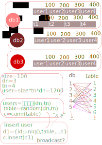

# 分库分表




## uniq id:

+ redis int incr
+ uuid
+ snowflake 


## ...


+ navicat
+ mybatic 
+ mbg
+ inline
+ shardingsphere
+ shardingvjdbc
+ yaml
+ round-robin
+ 笛卡尔积


## 伪代码

```
dbs=[
    {
       url:"mongodb://xxx@xxx...",
       table:[
           {
               name:"config",
               tn:1,
               list:[0..10],
               broadcast:true,   
               bind:[],
           },
           {
               name:"user",
               tn:10,
               size:1e4,
               list:[0..10],
               broadcast:false,   
               bind:[],
           },
           {
               name:"order",
               tn:10,
               size:1e4,
               list:[0..10],
               broadcast:false,   
               bind:["order_detail"],
           },
           {
               name:"order_detail",
               tn:10,
               size:1e4,
               list:[0..10],
               broadcast:false,   
               bind:[],
           },
           {
               name:"product",
               tn:10,
               size:1e4,
               list:[0..10],
               broadcast:false,   
               bind:[],
           },
       ],
       ...
]


父子
binding-tables={
   order:p  []//oid->[od1,od2,od3]
   order_detail,
}

broad_casttables=[config]

id2name=(id)->
    dn=8  
    tn=10
    did=id % dn
    tid=id % tn
    [did,tid]

id          table  db
0    -10000 [0..9] 0
10000-20000 [0..9] 1

id/10000        ->  db      [10000,20000,...]
id/10000 % 1000 ->  table   [1000,2000..9000]


R.liftN(2,(a,b)=>[a,b].join('_'))(R.range(1,10).map(x=>x*1e4),R.range(1,9).map(x=>x*1e3))


[
  '10000_1000', '10000_2000', '10000_3000', '10000_4000',
  '10000_5000', '10000_6000', '10000_7000', '10000_8000',
  '20000_1000', '20000_2000', '20000_3000', '20000_4000',
  '20000_5000', '20000_6000', '20000_7000', '20000_8000',
  '30000_1000', '30000_2000', '30000_3000', '30000_4000',
  '30000_5000', '30000_6000', '30000_7000', '30000_8000',
  '40000_1000', '40000_2000', '40000_3000', '40000_4000',
  '40000_5000', '40000_6000', '40000_7000', '40000_8000',
  '50000_1000', '50000_2000', '50000_3000', '50000_4000',
  '50000_5000', '50000_6000', '50000_7000', '50000_8000',
  '60000_1000', '60000_2000', '60000_3000', '60000_4000',
  '60000_5000', '60000_6000', '60000_7000', '60000_8000',
  '70000_1000', '70000_2000', '70000_3000', '70000_4000',
  '70000_5000', '70000_6000', '70000_7000', '70000_8000',
  '80000_1000', '80000_2000', '80000_3000', '80000_4000',
  '80000_5000', '80000_6000', '80000_7000', '80000_8000',
  '90000_1000', '90000_2000', '90000_3000', '90000_4000',
  '90000_5000', '90000_6000', '90000_7000', '90000_8000'
]


R.liftN(2,(a,b)=>[a,b].join('_'))(R.range(1,10),R.range(1,9))
db_table

[
  '1_1', '1_2', '1_3', '1_4', '1_5', '1_6', '1_7',
  '1_8', '2_1', '2_2', '2_3', '2_4', '2_5', '2_6',
  '2_7', '2_8', '3_1', '3_2', '3_3', '3_4', '3_5',
  '3_6', '3_7', '3_8', '4_1', '4_2', '4_3', '4_4',
  '4_5', '4_6', '4_7', '4_8', '5_1', '5_2', '5_3',
  '5_4', '5_5', '5_6', '5_7', '5_8', '6_1', '6_2',
  '6_3', '6_4', '6_5', '6_6', '6_7', '6_8', '7_1',
  '7_2', '7_3', '7_4', '7_5', '7_6', '7_7', '7_8',
  '8_1', '8_2', '8_3', '8_4', '8_5', '8_6', '8_7',
  '8_8', '9_1', '9_2', '9_3', '9_4', '9_5', '9_6',
  '9_7', '9_8'
]

0->0
1500->1 
2000->2
...
id/1000  ->[0,0]

[0..1000]    -> db0.user0
[1001..2000] -> db0.user1


{
    db1:{
      user1,
      user2,
      user3,
      usern,
      config,   //broadcast
      order,
      order_detail,// bind
      ...
    }

    db2:{
      user1,
      user2,
      user3,
      usern,
      config,   //broadcast
      order,
      order_detail,// bind
      ...
   }
}

```


## uuid


```javascript
    u=require('uuid')
    m=require('mongodb')

    id=u.v1()
    id=u.v4()
    //'0b8064a0-3b8e-11ea-9f8a-5b57819ed9db'
    //'d571c2e5-2460-458f-ab43-77e22343bdfa'

    id=m.ObjectID()
    //5e25b55ff695bf12256e8584
    const {
        index,
        createPk,
        createFromTime,
        createFromHexString,
        isValid,
        ObjectID,
        ObjectId
    }=m.ObjectId

    const {
        INT_CACHE_,
        MAX_VALUE,
        MIN_VALUE,
        NEG_ONE,
        ONE,
        TWO_PWR_16_DBL_,
        TWO_PWR_24_,
        TWO_PWR_24_DBL_,
        TWO_PWR_31_DBL_,
        TWO_PWR_32_DBL_,
        TWO_PWR_48_DBL_,
        TWO_PWR_63_DBL_,
        TWO_PWR_64_DBL_,
        ZERO,
        Timestamp,
        fromBits,
        fromInt,
        fromNumber,
        fromString
    }=m.Timestamp


    createPk()
    createFromTime(new Date())
    createFromHexString()

    z=Timestamp(new Date())
    z1=Timestamp(new Date())

    z.add()
    z.and()
    z.compare()
    z.div()
    z.equals()
    z.getHighBits()
    z.getLowBits()
    z.getLowBitsUnsigned()
    z.getNumBitsAbs()
    z.greaterThan()
    z.greaterThanOrEqual()
    z.isNegative()
    z.isOdd()
    z.isZero()
    z.lessThan(z1)
    z.lessThanOrEqual(z1)
    z.modulo()
    z.multiply()
    z.negate()
    z.not()
    z.notEquals()
    z.or()
    z.shiftLeft()
    z.shiftRight()
    z.shiftRightUnsigned()
    z.subtract()
    z.toInt()
    z.toJSON()
    z.toNumber()
    z.toString()
    z.xor()
```

