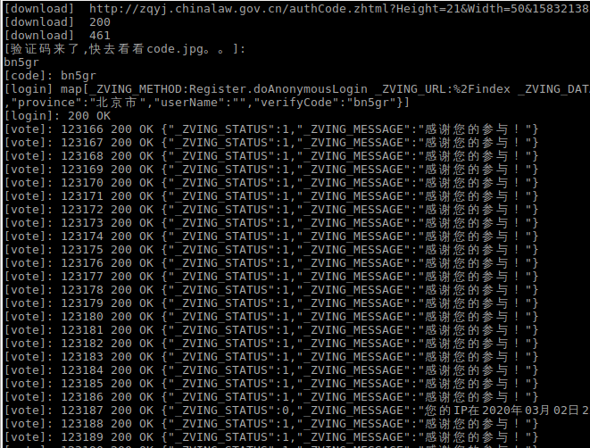

```
[download]  http://zqyj.chinalaw.gov.cn/authCode.zhtml?Height=21&Width=50&1583213839519
[download]  200
[download]  461
[验证码来了,快去看看code.jpg。。]:
bn5gr
[code]: bn5gr
[login] map[_ZVING_METHOD:Register.doAnonymousLogin _ZVING_URL:%2Findex _ZVING_DATA_FORMAT:json _ZVING_DATA:{"address":"","email":"","job":"销售|客服|市场","mobile":"","province":"北京市","userName":"","verifyCode":"bn5gr"}]
[login]: 200 OK
[vote]: 123166 200 OK {"_ZVING_STATUS":1,"_ZVING_MESSAGE":"感谢您的参与！"}
[vote]: 123167 200 OK {"_ZVING_STATUS":1,"_ZVING_MESSAGE":"感谢您的参与！"}
[vote]: 123168 200 OK {"_ZVING_STATUS":1,"_ZVING_MESSAGE":"感谢您的参与！"}
[vote]: 123169 200 OK {"_ZVING_STATUS":1,"_ZVING_MESSAGE":"感谢您的参与！"}
[vote]: 123170 200 OK {"_ZVING_STATUS":1,"_ZVING_MESSAGE":"感谢您的参与！"}
[vote]: 123171 200 OK {"_ZVING_STATUS":1,"_ZVING_MESSAGE":"感谢您的参与！"}
[vote]: 123172 200 OK {"_ZVING_STATUS":1,"_ZVING_MESSAGE":"感谢您的参与！"}
[vote]: 123173 200 OK {"_ZVING_STATUS":1,"_ZVING_MESSAGE":"感谢您的参与！"}
[vote]: 123174 200 OK {"_ZVING_STATUS":1,"_ZVING_MESSAGE":"感谢您的参与！"}
[vote]: 123175 200 OK {"_ZVING_STATUS":1,"_ZVING_MESSAGE":"感谢您的参与！"}
[vote]: 123176 200 OK {"_ZVING_STATUS":1,"_ZVING_MESSAGE":"感谢您的参与！"}
[vote]: 123177 200 OK {"_ZVING_STATUS":1,"_ZVING_MESSAGE":"感谢您的参与！"}
[vote]: 123178 200 OK {"_ZVING_STATUS":1,"_ZVING_MESSAGE":"感谢您的参与！"}
[vote]: 123179 200 OK {"_ZVING_STATUS":1,"_ZVING_MESSAGE":"感谢您的参与！"}
[vote]: 123180 200 OK {"_ZVING_STATUS":1,"_ZVING_MESSAGE":"感谢您的参与！"}
[vote]: 123181 200 OK {"_ZVING_STATUS":1,"_ZVING_MESSAGE":"感谢您的参与！"}
[vote]: 123182 200 OK {"_ZVING_STATUS":1,"_ZVING_MESSAGE":"感谢您的参与！"}
[vote]: 123183 200 OK {"_ZVING_STATUS":1,"_ZVING_MESSAGE":"感谢您的参与！"}
[vote]: 123184 200 OK {"_ZVING_STATUS":1,"_ZVING_MESSAGE":"感谢您的参与！"}
[vote]: 123185 200 OK {"_ZVING_STATUS":1,"_ZVING_MESSAGE":"感谢您的参与！"}
[vote]: 123186 200 OK {"_ZVING_STATUS":1,"_ZVING_MESSAGE":"感谢您的参与！"}
[vote]: 123187 200 OK {"_ZVING_STATUS":0,"_ZVING_MESSAGE":"您的IP在2020年03月02日22时49分已投票,现在不能参与投票！"}
[vote]: 123188 200 OK {"_ZVING_STATUS":1,"_ZVING_MESSAGE":"感谢您的参与！"}
[vote]: 123189 200 OK {"_ZVING_STATUS":1,"_ZVING_MESSAGE":"感谢您的参与！"}
[vote]: 123190 200 OK {"_ZVING_STATUS":1,"_ZVING_MESSAGE":"感谢您的参与！"}
[vote]: 123191 200 OK {"_ZVING_STATUS":1,"_ZVING_MESSAGE":"感谢您的参与！"}
[vote]: 123192 200 OK {"_ZVING_STATUS":1,"_ZVING_MESSAGE":"感谢您的参与！"}
[vote]: 123193 200 OK {"_ZVING_STATUS":1,"_ZVING_MESSAGE":"感谢您的参与！"}
[vote]: 123194 200 OK {"_ZVING_STATUS":1,"_ZVING_MESSAGE":"感谢您的参与！"}
[vote]: 123195 200 OK {"_ZVING_STATUS":1,"_ZVING_MESSAGE":"感谢您的参与！"}
[vote]: 123196 200 OK {"_ZVING_STATUS":1,"_ZVING_MESSAGE":"感谢您的参与！"}
[vote]: 123197 200 OK {"_ZVING_STATUS":1,"_ZVING_MESSAGE":"感谢您的参与！"}
[vote]: 123198 200 OK {"_ZVING_STATUS":0,"_ZVING_MESSAGE":"您的IP在2020年03月02日22时50分已投票,现在不能参与投票！"}
[vote]: 123199 200 OK {"_ZVING_STATUS":1,"_ZVING_MESSAGE":"感谢您的参与！"}
[vote]: 123200 200 OK {"_ZVING_STATUS":1,"_ZVING_MESSAGE":"感谢您的参与！"}
[vote]: 123201 200 OK {"_ZVING_STATUS":1,"_ZVING_MESSAGE":"感谢您的参与！"}
[vote]: 123202 200 OK {"_ZVING_STATUS":1,"_ZVING_MESSAGE":"感谢您的参与！"}
[vote]: 123203 200 OK {"_ZVING_STATUS":1,"_ZVING_MESSAGE":"感谢您的参与！"}
[vote]: 123204 200 OK {"_ZVING_STATUS":1,"_ZVING_MESSAGE":"感谢您的参与！"}
[vote]: 123205 200 OK {"_ZVING_STATUS":1,"_ZVING_MESSAGE":"感谢您的参与！"}
[vote]: 123206 200 OK {"_ZVING_STATUS":1,"_ZVING_MESSAGE":"感谢您的参与！"}
[vote]: 123207 200 OK {"_ZVING_STATUS":1,"_ZVING_MESSAGE":"感谢您的参与！"}
[vote]: 123208 200 OK {"_ZVING_STATUS":1,"_ZVING_MESSAGE":"感谢您的参与！"}
[vote]: 123209 200 OK {"_ZVING_STATUS":0,"_ZVING_MESSAGE":"您的IP在2020年03月02日22时51分已投票,现在不能参与投票！"}
[vote]: 123210 200 OK {"_ZVING_STATUS":0,"_ZVING_MESSAGE":"您的IP在2020年03月02日22时51分已投票,现在不能参与投票！"}
[vote]: 123211 200 OK {"_ZVING_STATUS":1,"_ZVING_MESSAGE":"感谢您的参与！"}
[vote]: 123212 200 OK {"_ZVING_STATUS":1,"_ZVING_MESSAGE":"感谢您的参与！"}
[vote]: 123213 200 OK {"_ZVING_STATUS":1,"_ZVING_MESSAGE":"感谢您的参与！"}
[vote]: 123214 200 OK {"_ZVING_STATUS":1,"_ZVING_MESSAGE":"感谢您的参与！"}
[download]  http://zqyj.chinalaw.gov.cn/authCode.zhtml?Height=21&Width=50&1583213859891
[download]  200
[download]  463
[验证码来了,快去看看code.jpg。。]:
7ggam
[code]: 7ggam
[login] map[_ZVING_DATA:{"address":"","email":"","job":"销售|客服|市场","mobile":"","province":"北京市","userName":"","verifyCode":"7ggam"} _ZVING_METHOD:Register.doAnonymousLogin _ZVING_URL:%2Findex _ZVING_DATA_FORMAT:json]
[login]: 200 OK
[vote]: 123166 200 OK {"_ZVING_STATUS":1,"_ZVING_MESSAGE":"感谢您的参与！"}
[vote]: 123167 200 OK {"_ZVING_STATUS":1,"_ZVING_MESSAGE":"感谢您的参与！"}
[vote]: 123168 200 OK {"_ZVING_STATUS":1,"_ZVING_MESSAGE":"感谢您的参与！"}


```


# 重新获取ip

+ 宽带 投完以后重启一下路由器
+ 手机开wifi热点 飞行模式开关一下





